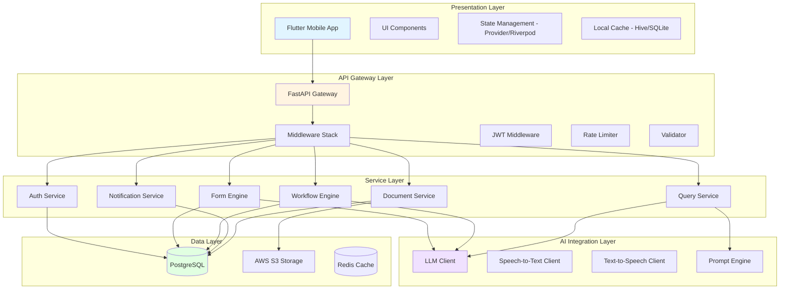
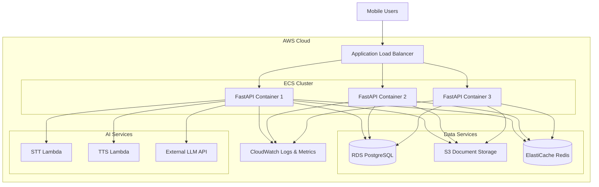
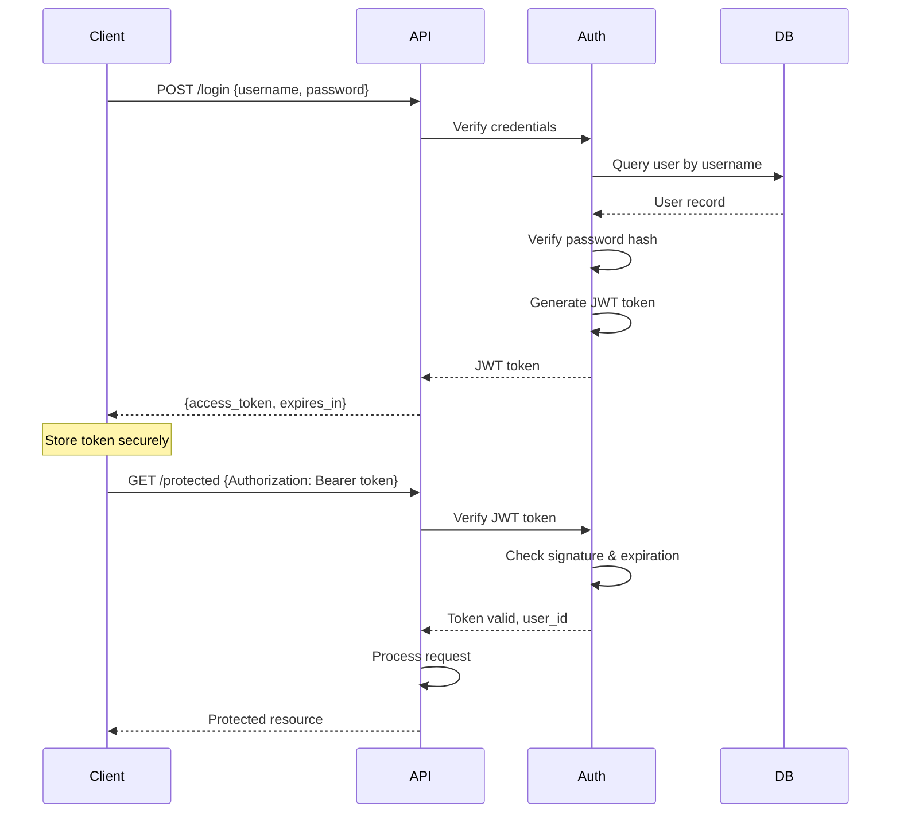

# Design Document: Civic Information Assistant

## Overview

The Civic Information Assistant is a full-stack mobile application built with Flutter (frontend) and Python FastAPI (backend) that provides AI-powered civic information services. The system architecture follows a microservices-inspired approach with clear separation between the presentation layer, API gateway, service layer, AI integration layer, and data persistence layer.

The design emphasizes:
- **Accessibility-first**: Voice interactions, multilingual support, and offline capabilities
- **Security**: JWT authentication, HTTPS encryption, and data protection
- **Scalability**: Containerized deployment on AWS with horizontal scaling capabilities
- **Resilience**: Offline-first caching, graceful degradation, and error recovery
- **Intelligence**: LLM-powered assistance with context-aware responses

### Technology Stack Summary

**Frontend**: Flutter/Dart with local caching, TTS/STT integration
**Backend**: Python FastAPI with async request handling
**AI Services**: LLM API integration, Speech-to-Text, Text-to-Speech
**Database**: PostgreSQL for structured data
**Storage**: AWS S3 for documents and forms
**Infrastructure**: Docker containers on AWS with load balancing
**Security**: JWT tokens, HTTPS/TLS, encryption at rest

## Architecture

### High-Level Architecture

The system follows a layered architecture pattern:



### Component Interaction Patterns

**Request Flow Pattern**:
1. Client sends request with JWT token
2. API Gateway validates token and rate limits
3. Request routed to appropriate service
4. Service processes request (may call AI services)
5. Service persists/retrieves data
6. Response returned through gateway to client

**Offline-First Pattern**:
1. Client attempts operation
2. If online: execute normally and cache result
3. If offline: queue operation in local storage
4. On reconnection: sync queued operations
5. Update local cache with server state

**Voice Interaction Pattern**:
1. User speaks into app
2. Audio streamed to STT service
3. Text sent to Query Service
4. LLM generates response
5. Response sent to TTS service
6. Audio played to user while text displayed

## Components and Interfaces

### Frontend Components

#### 1. Flutter Application Structure

```dart
// Main app structure
lib/
├── main.dart
├── core/
│   ├── auth/
│   │   ├── auth_provider.dart
│   │   └── jwt_storage.dart
│   ├── cache/
│   │   ├── cache_manager.dart
│   │   └── sync_service.dart
│   ├── network/
│   │   ├── api_client.dart
│   │   └── connectivity_monitor.dart
│   └── constants/
├── features/
│   ├── auth/
│   │   ├── screens/
│   │   ├── widgets/
│   │   └── providers/
│   ├── voice/
│   │   ├── voice_input_widget.dart
│   │   ├── stt_service.dart
│   │   └── tts_service.dart
│   ├── forms/
│   │   ├── form_screen.dart
│   │   ├── autofill_service.dart
│   │   └── form_models.dart
│   ├── workflow/
│   │   ├── workflow_screen.dart
│   │   ├── step_widget.dart
│   │   └── progress_tracker.dart
│   └── notifications/
│       ├── notification_handler.dart
│       └── notification_screen.dart
└── shared/
    ├── widgets/
    ├── models/
    └── utils/
```

**Key Interfaces**:

```dart
// API Client Interface
abstract class ApiClient {
  Future<Response> get(String endpoint, {Map<String, String>? headers});
  Future<Response> post(String endpoint, {dynamic body, Map<String, String>? headers});
  Future<Response> put(String endpoint, {dynamic body, Map<String, String>? headers});
  Future<Response> delete(String endpoint, {Map<String, String>? headers});
}

// Cache Manager Interface
abstract class CacheManager {
  Future<void> cacheData(String key, dynamic data);
  Future<dynamic> getCachedData(String key);
  Future<void> queueAction(Action action);
  Future<List<Action>> getQueuedActions();
  Future<void> clearQueue();
}

// Voice Service Interface
abstract class VoiceService {
  Stream<String> startListening(String languageCode);
  Future<void> stopListening();
  Future<void> speak(String text, String languageCode);
  Future<void> stopSpeaking();
}
```

### Backend Components

#### 2. FastAPI Application Structure

```python
# Backend structure
app/
├── main.py
├── core/
│   ├── config.py
│   ├── security.py
│   ├── database.py
│   └── dependencies.py
├── api/
│   ├── v1/
│   │   ├── endpoints/
│   │   │   ├── auth.py
│   │   │   ├── forms.py
│   │   │   ├── workflows.py
│   │   │   ├── queries.py
│   │   │   ├── documents.py
│   │   │   └── notifications.py
│   │   └── router.py
│   └── middleware/
│       ├── jwt_middleware.py
│       ├── rate_limiter.py
│       └── error_handler.py
├── services/
│   ├── auth_service.py
│   ├── form_engine.py
│   ├── workflow_engine.py
│   ├── notification_service.py
│   ├── document_service.py
│   └── query_service.py
├── ai/
│   ├── llm_client.py
│   ├── prompt_templates.py
│   ├── stt_client.py
│   └── tts_client.py
├── models/
│   ├── user.py
│   ├── form.py
│   ├── workflow.py
│   ├── document.py
│   └── notification.py
├── schemas/
│   ├── auth.py
│   ├── form.py
│   ├── workflow.py
│   └── query.py
└── utils/
    ├── validators.py
    ├── encryption.py
    └── helpers.py
```

**Key Interfaces**:

```python
# Authentication Service Interface
class AuthService:
    async def register_user(self, user_data: UserCreate) -> User:
        """Register a new user with encrypted credentials"""
        pass
    
    async def authenticate_user(self, username: str, password: str) -> Optional[User]:
        """Authenticate user and return user object if valid"""
        pass
    
    async def create_access_token(self, user_id: int) -> str:
        """Generate JWT access token"""
        pass
    
    async def verify_token(self, token: str) -> Optional[TokenData]:
        """Verify JWT token and return token data"""
        pass

# Form Engine Interface
class FormEngine:
    async def get_form_template(self, form_id: str) -> FormTemplate:
        """Retrieve form template structure"""
        pass
    
    async def autofill_form(self, form_id: str, user_id: int) -> FilledForm:
        """Auto-populate form fields with user data"""
        pass
    
    async def validate_form(self, form_data: FormSubmission) -> ValidationResult:
        """Validate form data against template rules"""
        pass
    
    async def submit_form(self, form_data: FormSubmission) -> SubmissionResult:
        """Process and store form submission"""
        pass

# Workflow Engine Interface
class WorkflowEngine:
    async def get_workflow(self, workflow_id: str) -> Workflow:
        """Retrieve workflow definition"""
        pass
    
    async def get_user_progress(self, workflow_id: str, user_id: int) -> WorkflowProgress:
        """Get user's progress through workflow"""
        pass
    
    async def complete_step(self, workflow_id: str, step_id: str, user_id: int) -> StepResult:
        """Mark step as complete and return next step"""
        pass
    
    async def get_step_guidance(self, step_id: str, language: str) -> StepGuidance:
        """Get detailed guidance for a specific step"""
        pass

# Query Service Interface
class QueryService:
    async def process_query(self, query: str, user_id: int, language: str, context: dict) -> QueryResponse:
        """Process user query and generate response"""
        pass
    
    async def get_conversation_context(self, user_id: int, session_id: str) -> ConversationContext:
        """Retrieve conversation history for context"""
        pass
    
    async def save_conversation(self, user_id: int, session_id: str, message: Message) -> None:
        """Save conversation message"""
        pass

# LLM Client Interface
class LLMClient:
    async def generate_response(self, prompt: str, context: dict, language: str) -> str:
        """Generate LLM response"""
        pass
    
    async def validate_field_mapping(self, form_fields: list, user_data: dict) -> dict:
        """Use LLM to intelligently map user data to form fields"""
        pass
    
    async def generate_step_explanation(self, step: WorkflowStep, language: str) -> str:
        """Generate detailed explanation for workflow step"""
        pass
```

### AI Integration Components

#### 3. LLM Integration

```python
class LLMClient:
    def __init__(self, api_key: str, model: str = "gpt-4"):
        self.api_key = api_key
        self.model = model
        self.client = OpenAI(api_key=api_key)
    
    async def generate_response(
        self,
        prompt: str,
        context: dict,
        language: str,
        max_tokens: int = 500
    ) -> str:
        """
        Generate contextual response using LLM
        
        Args:
            prompt: User query or prompt
            context: Conversation and user context
            language: Target language for response
            max_tokens: Maximum response length
        
        Returns:
            Generated response text
        """
        system_prompt = self._build_system_prompt(language, context)
        messages = [
            {"role": "system", "content": system_prompt},
            {"role": "user", "content": prompt}
        ]
        
        response = await self.client.chat.completions.create(
            model=self.model,
            messages=messages,
            max_tokens=max_tokens,
            temperature=0.7
        )
        
        return response.choices[0].message.content
    
    def _build_system_prompt(self, language: str, context: dict) -> str:
        """Build system prompt with civic assistant context"""
        return f"""You are a helpful civic information assistant.
        Language: {language}
        Context: {context.get('civic_process', 'general')}
        
        Provide clear, accurate information about civic processes.
        Use simple language appropriate for all education levels.
        If you don't know something, say so and suggest alternatives.
        """
```

#### 4. Speech Services Integration

```python
# Speech-to-Text Client
class STTClient:
    async def transcribe_audio(
        self,
        audio_stream: bytes,
        language_code: str
    ) -> str:
        """
        Transcribe audio to text
        
        Args:
            audio_stream: Audio data in bytes
            language_code: Language code (e.g., 'en-US', 'es-ES')
        
        Returns:
            Transcribed text
        """
        pass

# Text-to-Speech Client
class TTSClient:
    async def synthesize_speech(
        self,
        text: str,
        language_code: str,
        voice_gender: str = "neutral"
    ) -> bytes:
        """
        Convert text to speech audio
        
        Args:
            text: Text to convert
            language_code: Language code
            voice_gender: Voice gender preference
        
        Returns:
            Audio data in bytes
        """
        pass
```

## Data Models

### Database Schema

```sql
-- Users table
CREATE TABLE users (
    id SERIAL PRIMARY KEY,
    username VARCHAR(255) UNIQUE NOT NULL,
    email VARCHAR(255) UNIQUE NOT NULL,
    password_hash VARCHAR(255) NOT NULL,
    full_name VARCHAR(255),
    phone_number VARCHAR(50),
    preferred_language VARCHAR(10) DEFAULT 'en',
    created_at TIMESTAMP DEFAULT CURRENT_TIMESTAMP,
    updated_at TIMESTAMP DEFAULT CURRENT_TIMESTAMP,
    is_active BOOLEAN DEFAULT TRUE
);

-- User profiles table (for form auto-fill data)
CREATE TABLE user_profiles (
    id SERIAL PRIMARY KEY,
    user_id INTEGER REFERENCES users(id) ON DELETE CASCADE,
    address_line1 VARCHAR(255),
    address_line2 VARCHAR(255),
    city VARCHAR(100),
    state VARCHAR(100),
    postal_code VARCHAR(20),
    country VARCHAR(100),
    date_of_birth DATE,
    national_id VARCHAR(100),
    profile_data JSONB,  -- Flexible storage for additional fields
    created_at TIMESTAMP DEFAULT CURRENT_TIMESTAMP,
    updated_at TIMESTAMP DEFAULT CURRENT_TIMESTAMP
);

-- Form templates table
CREATE TABLE form_templates (
    id SERIAL PRIMARY KEY,
    form_code VARCHAR(100) UNIQUE NOT NULL,
    form_name VARCHAR(255) NOT NULL,
    description TEXT,
    category VARCHAR(100),
    fields JSONB NOT NULL,  -- Form field definitions
    validation_rules JSONB,
    language_variants JSONB,  -- Translations
    is_active BOOLEAN DEFAULT TRUE,
    created_at TIMESTAMP DEFAULT CURRENT_TIMESTAMP,
    updated_at TIMESTAMP DEFAULT CURRENT_TIMESTAMP
);

-- Form submissions table
CREATE TABLE form_submissions (
    id SERIAL PRIMARY KEY,
    user_id INTEGER REFERENCES users(id),
    form_template_id INTEGER REFERENCES form_templates(id),
    submission_data JSONB NOT NULL,
    status VARCHAR(50) DEFAULT 'submitted',
    submitted_at TIMESTAMP DEFAULT CURRENT_TIMESTAMP,
    processed_at TIMESTAMP,
    reference_number VARCHAR(100) UNIQUE
);

-- Workflows table
CREATE TABLE workflows (
    id SERIAL PRIMARY KEY,
    workflow_code VARCHAR(100) UNIQUE NOT NULL,
    workflow_name VARCHAR(255) NOT NULL,
    description TEXT,
    category VARCHAR(100),
    steps JSONB NOT NULL,  -- Ordered list of steps
    language_variants JSONB,
    estimated_duration INTEGER,  -- in minutes
    is_active BOOLEAN DEFAULT TRUE,
    created_at TIMESTAMP DEFAULT CURRENT_TIMESTAMP,
    updated_at TIMESTAMP DEFAULT CURRENT_TIMESTAMP
);

-- User workflow progress table
CREATE TABLE user_workflow_progress (
    id SERIAL PRIMARY KEY,
    user_id INTEGER REFERENCES users(id) ON DELETE CASCADE,
    workflow_id INTEGER REFERENCES workflows(id),
    current_step_index INTEGER DEFAULT 0,
    completed_steps JSONB DEFAULT '[]',
    progress_data JSONB,  -- Additional progress information
    status VARCHAR(50) DEFAULT 'in_progress',
    started_at TIMESTAMP DEFAULT CURRENT_TIMESTAMP,
    completed_at TIMESTAMP,
    UNIQUE(user_id, workflow_id, started_at)
);

-- Documents table
CREATE TABLE documents (
    id SERIAL PRIMARY KEY,
    user_id INTEGER REFERENCES users(id) ON DELETE CASCADE,
    document_type VARCHAR(100),
    file_name VARCHAR(255) NOT NULL,
    file_path VARCHAR(500) NOT NULL,  -- S3 path
    file_size INTEGER,
    mime_type VARCHAR(100),
    encryption_key VARCHAR(255),  -- Encrypted storage key
    metadata JSONB,
    uploaded_at TIMESTAMP DEFAULT CURRENT_TIMESTAMP,
    is_deleted BOOLEAN DEFAULT FALSE
);

-- Notifications table
CREATE TABLE notifications (
    id SERIAL PRIMARY KEY,
    user_id INTEGER REFERENCES users(id) ON DELETE CASCADE,
    notification_type VARCHAR(50) NOT NULL,
    title VARCHAR(255) NOT NULL,
    message TEXT NOT NULL,
    data JSONB,  -- Additional notification data
    is_read BOOLEAN DEFAULT FALSE,
    sent_at TIMESTAMP DEFAULT CURRENT_TIMESTAMP,
    read_at TIMESTAMP,
    delivery_status VARCHAR(50) DEFAULT 'pending'
);

-- Conversation history table
CREATE TABLE conversation_history (
    id SERIAL PRIMARY KEY,
    user_id INTEGER REFERENCES users(id) ON DELETE CASCADE,
    session_id VARCHAR(100) NOT NULL,
    message_role VARCHAR(20) NOT NULL,  -- 'user' or 'assistant'
    message_content TEXT NOT NULL,
    language VARCHAR(10),
    created_at TIMESTAMP DEFAULT CURRENT_TIMESTAMP,
    INDEX idx_session (user_id, session_id, created_at)
);

-- Audit logs table
CREATE TABLE audit_logs (
    id SERIAL PRIMARY KEY,
    user_id INTEGER REFERENCES users(id),
    action VARCHAR(100) NOT NULL,
    resource_type VARCHAR(100),
    resource_id INTEGER,
    ip_address VARCHAR(50),
    user_agent TEXT,
    details JSONB,
    created_at TIMESTAMP DEFAULT CURRENT_TIMESTAMP
);

-- Create indexes for performance
CREATE INDEX idx_users_email ON users(email);
CREATE INDEX idx_users_username ON users(username);
CREATE INDEX idx_form_submissions_user ON form_submissions(user_id);
CREATE INDEX idx_form_submissions_status ON form_submissions(status);
CREATE INDEX idx_workflow_progress_user ON user_workflow_progress(user_id);
CREATE INDEX idx_documents_user ON documents(user_id);
CREATE INDEX idx_notifications_user ON notifications(user_id, is_read);
CREATE INDEX idx_conversation_session ON conversation_history(user_id, session_id);
```

### Python Data Models (Pydantic Schemas)

```python
from pydantic import BaseModel, EmailStr, Field
from typing import Optional, List, Dict, Any
from datetime import datetime
from enum import Enum

# User models
class UserCreate(BaseModel):
    username: str = Field(..., min_length=3, max_length=50)
    email: EmailStr
    password: str = Field(..., min_length=8)
    full_name: Optional[str] = None
    phone_number: Optional[str] = None
    preferred_language: str = "en"

class UserResponse(BaseModel):
    id: int
    username: str
    email: str
    full_name: Optional[str]
    preferred_language: str
    created_at: datetime
    
    class Config:
        from_attributes = True

class TokenResponse(BaseModel):
    access_token: str
    token_type: str = "bearer"
    expires_in: int
    user: UserResponse

# Form models
class FormField(BaseModel):
    field_id: str
    field_type: str  # text, number, date, select, file
    label: str
    required: bool = False
    validation_rules: Optional[Dict[str, Any]] = None
    options: Optional[List[str]] = None

class FormTemplate(BaseModel):
    id: int
    form_code: str
    form_name: str
    description: Optional[str]
    category: str
    fields: List[FormField]
    
    class Config:
        from_attributes = True

class FormSubmission(BaseModel):
    form_template_id: int
    submission_data: Dict[str, Any]

class FormSubmissionResponse(BaseModel):
    id: int
    reference_number: str
    status: str
    submitted_at: datetime

# Workflow models
class WorkflowStep(BaseModel):
    step_id: str
    step_number: int
    title: str
    description: str
    required_actions: List[str]
    required_documents: Optional[List[str]] = None
    estimated_duration: Optional[int] = None

class Workflow(BaseModel):
    id: int
    workflow_code: str
    workflow_name: str
    description: str
    category: str
    steps: List[WorkflowStep]
    estimated_duration: Optional[int]
    
    class Config:
        from_attributes = True

class WorkflowProgress(BaseModel):
    workflow_id: int
    current_step_index: int
    completed_steps: List[str]
    status: str
    started_at: datetime
    current_step: WorkflowStep

# Query models
class QueryRequest(BaseModel):
    query: str
    language: str = "en"
    session_id: Optional[str] = None
    context: Optional[Dict[str, Any]] = None

class QueryResponse(BaseModel):
    response: str
    session_id: str
    suggested_actions: Optional[List[str]] = None
    related_workflows: Optional[List[str]] = None

# Notification models
class NotificationType(str, Enum):
    INFO = "info"
    WARNING = "warning"
    SUCCESS = "success"
    REMINDER = "reminder"

class NotificationCreate(BaseModel):
    user_id: int
    notification_type: NotificationType
    title: str
    message: str
    data: Optional[Dict[str, Any]] = None

class NotificationResponse(BaseModel):
    id: int
    notification_type: str
    title: str
    message: str
    is_read: bool
    sent_at: datetime
    
    class Config:
        from_attributes = True

# Document models
class DocumentUpload(BaseModel):
    document_type: str
    file_name: str
    metadata: Optional[Dict[str, Any]] = None

class DocumentResponse(BaseModel):
    id: int
    document_type: str
    file_name: str
    file_size: int
    uploaded_at: datetime
    
    class Config:
        from_attributes = True
```

### Flutter Data Models

```dart
// User model
class User {
  final int id;
  final String username;
  final String email;
  final String? fullName;
  final String preferredLanguage;
  final DateTime createdAt;
  
  User({
    required this.id,
    required this.username,
    required this.email,
    this.fullName,
    required this.preferredLanguage,
    required this.createdAt,
  });
  
  factory User.fromJson(Map<String, dynamic> json) {
    return User(
      id: json['id'],
      username: json['username'],
      email: json['email'],
      fullName: json['full_name'],
      preferredLanguage: json['preferred_language'],
      createdAt: DateTime.parse(json['created_at']),
    );
  }
  
  Map<String, dynamic> toJson() {
    return {
      'id': id,
      'username': username,
      'email': email,
      'full_name': fullName,
      'preferred_language': preferredLanguage,
      'created_at': createdAt.toIso8601String(),
    };
  }
}

// Form models
class FormField {
  final String fieldId;
  final String fieldType;
  final String label;
  final bool required;
  final Map<String, dynamic>? validationRules;
  final List<String>? options;
  String? value;
  bool isAutoFilled;
  
  FormField({
    required this.fieldId,
    required this.fieldType,
    required this.label,
    this.required = false,
    this.validationRules,
    this.options,
    this.value,
    this.isAutoFilled = false,
  });
  
  factory FormField.fromJson(Map<String, dynamic> json) {
    return FormField(
      fieldId: json['field_id'],
      fieldType: json['field_type'],
      label: json['label'],
      required: json['required'] ?? false,
      validationRules: json['validation_rules'],
      options: json['options']?.cast<String>(),
    );
  }
}

class FormTemplate {
  final int id;
  final String formCode;
  final String formName;
  final String? description;
  final String category;
  final List<FormField> fields;
  
  FormTemplate({
    required this.id,
    required this.formCode,
    required this.formName,
    this.description,
    required this.category,
    required this.fields,
  });
  
  factory FormTemplate.fromJson(Map<String, dynamic> json) {
    return FormTemplate(
      id: json['id'],
      formCode: json['form_code'],
      formName: json['form_name'],
      description: json['description'],
      category: json['category'],
      fields: (json['fields'] as List)
          .map((f) => FormField.fromJson(f))
          .toList(),
    );
  }
}

// Workflow models
class WorkflowStep {
  final String stepId;
  final int stepNumber;
  final String title;
  final String description;
  final List<String> requiredActions;
  final List<String>? requiredDocuments;
  final int? estimatedDuration;
  bool isCompleted;
  
  WorkflowStep({
    required this.stepId,
    required this.stepNumber,
    required this.title,
    required this.description,
    required this.requiredActions,
    this.requiredDocuments,
    this.estimatedDuration,
    this.isCompleted = false,
  });
  
  factory WorkflowStep.fromJson(Map<String, dynamic> json) {
    return WorkflowStep(
      stepId: json['step_id'],
      stepNumber: json['step_number'],
      title: json['title'],
      description: json['description'],
      requiredActions: (json['required_actions'] as List).cast<String>(),
      requiredDocuments: json['required_documents']?.cast<String>(),
      estimatedDuration: json['estimated_duration'],
    );
  }
}

class WorkflowProgress {
  final int workflowId;
  final int currentStepIndex;
  final List<String> completedSteps;
  final String status;
  final DateTime startedAt;
  final WorkflowStep currentStep;
  
  WorkflowProgress({
    required this.workflowId,
    required this.currentStepIndex,
    required this.completedSteps,
    required this.status,
    required this.startedAt,
    required this.currentStep,
  });
  
  factory WorkflowProgress.fromJson(Map<String, dynamic> json) {
    return WorkflowProgress(
      workflowId: json['workflow_id'],
      currentStepIndex: json['current_step_index'],
      completedSteps: (json['completed_steps'] as List).cast<String>(),
      status: json['status'],
      startedAt: DateTime.parse(json['started_at']),
      currentStep: WorkflowStep.fromJson(json['current_step']),
    );
  }
}

// Cached action model for offline queue
class CachedAction {
  final String id;
  final String actionType;
  final String endpoint;
  final Map<String, dynamic> data;
  final DateTime timestamp;
  bool isSynced;
  
  CachedAction({
    required this.id,
    required this.actionType,
    required this.endpoint,
    required this.data,
    required this.timestamp,
    this.isSynced = false,
  });
  
  Map<String, dynamic> toJson() {
    return {
      'id': id,
      'action_type': actionType,
      'endpoint': endpoint,
      'data': data,
      'timestamp': timestamp.toIso8601String(),
      'is_synced': isSynced,
    };
  }
  
  factory CachedAction.fromJson(Map<String, dynamic> json) {
    return CachedAction(
      id: json['id'],
      actionType: json['action_type'],
      endpoint: json['endpoint'],
      data: json['data'],
      timestamp: DateTime.parse(json['timestamp']),
      isSynced: json['is_synced'] ?? false,
    );
  }
}
```


## Correctness Properties

A property is a characteristic or behavior that should hold true across all valid executions of a system—essentially, a formal statement about what the system should do. Properties serve as the bridge between human-readable specifications and machine-verifiable correctness guarantees.

The following properties are derived from the acceptance criteria in the requirements document. Each property represents a universal rule that should hold for all valid inputs and states of the system.

### Authentication and Authorization Properties

**Property 1: User Registration Creates Encrypted Accounts**
*For any* valid user registration data (username, email, password), creating a new account should result in a user record with encrypted credentials stored in the database.
**Validates: Requirements 1.1**

**Property 2: Valid Login Returns JWT Token**
*For any* registered user with valid credentials, authentication should return a valid JWT token with appropriate expiration time.
**Validates: Requirements 1.2**

**Property 3: Invalid Authentication Denies Access**
*For any* request to protected resources without valid authentication (missing token, invalid token, or wrong credentials), the system should deny access and return an authentication error.
**Validates: Requirements 1.4**

### Multilingual Support Properties

**Property 4: Language Selection Updates Interface**
*For any* supported language selection, all interface elements should be displayed in the selected language with proper translations.
**Validates: Requirements 2.1**

**Property 5: Language Switching Preserves Session State**
*For any* active session with state data, switching the language should update all content to the new language while preserving all session state (workflow progress, form data, conversation context).
**Validates: Requirements 2.2**

**Property 6: Voice Interface Supports All Configured Languages**
*For any* configured language, the voice interface should support both speech-to-text and text-to-speech operations, returning valid text from audio input and valid audio from text input.
**Validates: Requirements 2.3, 2.4**

**Property 7: LLM Responses Match Request Language**
*For any* user query in a supported language, the LLM-generated response should be in the same language as the query.
**Validates: Requirements 2.5**

### Voice Interface Properties

**Property 8: Unclear Voice Input Triggers Clarification**
*For any* voice input with low confidence score or ambiguous transcription, the system should request clarification through voice prompts before proceeding.
**Validates: Requirements 3.3**

**Property 9: Continuous Voice Conversation Maintains Context**
*For any* sequence of voice inputs within a session, the system should maintain conversation context without requiring re-initialization between inputs.
**Validates: Requirements 3.4**

### Form Auto-Fill Properties

**Property 10: Form Filling Retrieves User Profile**
*For any* user with stored profile data initiating form filling, the Form Engine should retrieve the complete user profile information.
**Validates: Requirements 4.1**

**Property 11: Matching Fields Auto-Populate Correctly**
*For any* form field that matches a user profile data field (by field type and semantic meaning), the Form Engine should automatically populate that field with the correct value from the user profile.
**Validates: Requirements 4.2**

**Property 12: Auto-Filled Fields Are Marked**
*For any* form field that is automatically populated, the system should set the isAutoFilled flag to true for user review.
**Validates: Requirements 4.3**

**Property 13: Modified Auto-Fill Updates Profile**
*For any* auto-filled field that a user modifies, the system should update the user's profile with the new value for future form filling operations.
**Validates: Requirements 4.4**

**Property 14: Missing Required Data Triggers Prompts**
*For any* form with required fields where user profile data is incomplete, the Form Engine should generate prompts requesting the missing information.
**Validates: Requirements 4.5**

**Property 15: Form Validation Before Submission**
*For any* form with validation rules, all populated fields should be validated against those rules before submission is allowed.
**Validates: Requirements 4.6**

### Workflow Guidance Properties

**Property 16: Workflow Request Returns Structured Steps**
*For any* civic process workflow, requesting guidance should return a structured, ordered sequence of steps with all required metadata (step number, title, description, required actions).
**Validates: Requirements 5.1**

**Property 17: Step Completion Advances Workflow**
*For any* workflow step that is marked complete, the Workflow Engine should update progress to mark that step as completed and return the next step in the sequence.
**Validates: Requirements 5.2**

**Property 18: Step Clarification Generates Language-Specific Explanation**
*For any* workflow step and user language, requesting clarification should generate a detailed explanation in the user's selected language.
**Validates: Requirements 5.3**

**Property 19: Workflow Progress Persists Across Sessions**
*For any* incomplete workflow, ending the session and starting a new session should restore the workflow progress to the last completed step.
**Validates: Requirements 5.4, 5.5**

**Property 20: Workflow Responses Include Progress Indicators**
*For any* workflow step response, the system should include progress information (current step number, total steps, completion percentage).
**Validates: Requirements 5.6**

### Notification Properties

**Property 21: Status Changes Trigger Notifications**
*For any* civic process status change event, the Notification Service should create and send a notification to the affected user.
**Validates: Requirements 6.1**

**Property 22: Approaching Deadlines Send Reminders**
*For any* civic process with a deadline within the reminder threshold, the Notification Service should send reminder notifications to the user.
**Validates: Requirements 6.2**

**Property 23: Notifications Include Navigation Links**
*For any* notification sent to a user, the notification should include navigation data (deep link or reference) to the relevant process or information.
**Validates: Requirements 6.4**

**Property 24: Offline Notifications Queue for Delivery**
*For any* notification triggered while a user is offline, the Notification Service should queue the notification and deliver it when connectivity is restored.
**Validates: Requirements 6.5**

### Offline-First Properties

**Property 25: Online Content Viewing Caches Data**
*For any* civic information content viewed while online, the Cache Manager should store that content in local cache for offline access.
**Validates: Requirements 7.1**

**Property 26: Cached Content Round-Trip**
*For any* content cached while online, accessing that content while offline should retrieve and display the same content from local cache.
**Validates: Requirements 7.1, 7.2**

**Property 27: Offline Actions Synchronize When Online**
*For any* action performed while offline, the Cache Manager should queue the action locally, and when connectivity is restored, automatically synchronize that action with the backend.
**Validates: Requirements 7.3, 7.4**

**Property 28: Offline Status Reflected in UI**
*For any* connectivity state (online or offline), the UI should clearly indicate which features are available and which require connectivity.
**Validates: Requirements 7.5**

**Property 29: Cache Prioritizes Recent and Frequent Content**
*For any* cache eviction scenario when storage is full, the Cache Manager should retain recently accessed and frequently accessed content over older, less-accessed content.
**Validates: Requirements 7.6**

### Document Storage Properties

**Property 30: Document Upload-Download Round-Trip**
*For any* document uploaded by a user, the document should be encrypted and stored, and when retrieved, should be decrypted and return content identical to the original upload.
**Validates: Requirements 8.1, 8.2**

**Property 31: Supported Document Formats Upload Successfully**
*For any* document in a supported format (PDF, JPEG, PNG, etc.), the upload operation should succeed and store the document.
**Validates: Requirements 8.3**

**Property 32: Document Metadata Persists with Upload**
*For any* uploaded document, the Storage Service should store metadata including upload date, document type, file size, and associated civic processes.
**Validates: Requirements 8.5**

**Property 33: Document Deletion Removes All Data**
*For any* document deleted by a user, both the document file and all associated metadata should be permanently removed from storage.
**Validates: Requirements 8.6**

### Query Processing Properties

**Property 34: Process Queries Include Required Information**
*For any* query about a civic process, the LLM response should include relevant process steps, requirements, and deadlines when available.
**Validates: Requirements 9.3**

**Property 35: Conversation Context Persists Within Session**
*For any* multi-turn conversation within a session, the LLM Service should maintain context from previous exchanges when generating responses.
**Validates: Requirements 9.5**

**Property 36: Form Queries Guide to Workflows**
*For any* query involving form filling or document submission, the LLM response should include guidance to the appropriate workflow.
**Validates: Requirements 9.6**

### Accessibility Properties

**Property 37: UI Elements Have Accessibility Labels**
*For any* interactive UI element, the element should have proper accessibility labels for screen reader compatibility.
**Validates: Requirements 10.1**

**Property 38: Text Size Changes Apply Globally**
*For any* text size adjustment, the change should apply to all text elements throughout the application interface.
**Validates: Requirements 10.3**

**Property 39: Text Interactions Have Voice Alternatives**
*For any* text-based interaction in the application, there should be an equivalent voice-based alternative available.
**Validates: Requirements 10.4**

**Property 40: Interactive Elements Support Keyboard Navigation**
*For any* interactive element in the application, the element should be accessible and operable via keyboard navigation.
**Validates: Requirements 10.5**

### Security and Privacy Properties

**Property 41: Personal Data Encrypted at Rest**
*For any* personal data stored in the database, the data should be encrypted using industry-standard encryption algorithms.
**Validates: Requirements 11.1**

**Property 42: Data Deletion Removes All User Data**
*For any* user data deletion request, all user data (profile, documents, conversations, workflow progress) should be permanently removed within the specified timeframe.
**Validates: Requirements 11.3**

**Property 43: Rate Limiting Blocks Excessive Requests**
*For any* sequence of authentication requests exceeding the rate limit threshold from a single source, subsequent requests should be blocked with appropriate error responses.
**Validates: Requirements 11.5**

**Property 44: Sensitive Data Access Creates Audit Logs**
*For any* access to sensitive user data (profile, documents, credentials), an audit log entry should be created with timestamp, user ID, action, and resource information.
**Validates: Requirements 11.6**

## Error Handling

### Error Categories

The system handles errors across several categories:

1. **Authentication Errors**: Invalid credentials, expired tokens, missing authentication
2. **Validation Errors**: Invalid form data, missing required fields, format violations
3. **Network Errors**: Connection failures, timeouts, service unavailability
4. **AI Service Errors**: LLM failures, STT/TTS service errors, rate limiting
5. **Storage Errors**: Upload failures, quota exceeded, file not found
6. **Business Logic Errors**: Invalid workflow transitions, permission denied

### Error Handling Strategies

**Graceful Degradation**:
- When LLM service is unavailable, provide cached responses or basic rule-based responses
- When voice services fail, fall back to text-only interaction
- When network is unavailable, enable offline mode with queued actions

**User-Friendly Error Messages**:
```python
class ErrorResponse(BaseModel):
    error_code: str
    message: str  # User-friendly message in user's language
    details: Optional[Dict[str, Any]] = None
    suggested_actions: Optional[List[str]] = None
    retry_after: Optional[int] = None  # For rate limiting

# Example error responses
ERRORS = {
    "AUTH_001": {
        "message": "Invalid credentials. Please check your username and password.",
        "suggested_actions": ["Reset password", "Contact support"]
    },
    "FORM_001": {
        "message": "Required field missing: {field_name}",
        "suggested_actions": ["Fill in the required field", "Use voice input"]
    },
    "NETWORK_001": {
        "message": "Connection lost. Your actions will be saved and synced when online.",
        "suggested_actions": ["Continue working offline", "Check connection"]
    },
    "AI_001": {
        "message": "AI service temporarily unavailable. Using cached responses.",
        "suggested_actions": ["Try again later", "Use basic search"]
    }
}
```

**Retry Logic**:
```python
async def retry_with_exponential_backoff(
    func: Callable,
    max_retries: int = 3,
    base_delay: float = 1.0
) -> Any:
    """Retry failed operations with exponential backoff"""
    for attempt in range(max_retries):
        try:
            return await func()
        except RetryableError as e:
            if attempt == max_retries - 1:
                raise
            delay = base_delay * (2 ** attempt)
            await asyncio.sleep(delay)
```

**Circuit Breaker Pattern**:
```python
class CircuitBreaker:
    """Prevent cascading failures by breaking circuit to failing services"""
    def __init__(self, failure_threshold: int = 5, timeout: int = 60):
        self.failure_threshold = failure_threshold
        self.timeout = timeout
        self.failure_count = 0
        self.last_failure_time = None
        self.state = "closed"  # closed, open, half-open
    
    async def call(self, func: Callable) -> Any:
        if self.state == "open":
            if time.time() - self.last_failure_time > self.timeout:
                self.state = "half-open"
            else:
                raise CircuitBreakerOpenError("Service temporarily unavailable")
        
        try:
            result = await func()
            if self.state == "half-open":
                self.state = "closed"
                self.failure_count = 0
            return result
        except Exception as e:
            self.failure_count += 1
            self.last_failure_time = time.time()
            if self.failure_count >= self.failure_threshold:
                self.state = "open"
            raise
```

### Logging and Monitoring

```python
import logging
from datetime import datetime

class StructuredLogger:
    """Structured logging for better observability"""
    
    @staticmethod
    def log_request(user_id: int, endpoint: str, method: str, duration: float):
        logging.info({
            "event": "api_request",
            "user_id": user_id,
            "endpoint": endpoint,
            "method": method,
            "duration_ms": duration * 1000,
            "timestamp": datetime.utcnow().isoformat()
        })
    
    @staticmethod
    def log_error(error: Exception, context: dict):
        logging.error({
            "event": "error",
            "error_type": type(error).__name__,
            "error_message": str(error),
            "context": context,
            "timestamp": datetime.utcnow().isoformat()
        })
    
    @staticmethod
    def log_ai_interaction(user_id: int, query: str, response: str, duration: float):
        logging.info({
            "event": "ai_interaction",
            "user_id": user_id,
            "query_length": len(query),
            "response_length": len(response),
            "duration_ms": duration * 1000,
            "timestamp": datetime.utcnow().isoformat()
        })
```

## Testing Strategy

### Dual Testing Approach

The testing strategy employs both unit testing and property-based testing as complementary approaches:

**Unit Tests**: Focus on specific examples, edge cases, and integration points
- Specific user registration scenarios
- Edge cases like empty forms, expired tokens
- Integration between services
- Error handling paths

**Property-Based Tests**: Verify universal properties across all inputs
- All correctness properties defined above
- Minimum 100 iterations per property test
- Randomized input generation for comprehensive coverage

### Property-Based Testing Configuration

**Framework Selection**:
- **Python Backend**: Use `hypothesis` library for property-based testing
- **Flutter Frontend**: Use `test` package with custom property test helpers

**Test Configuration**:
```python
# Python property test example using hypothesis
from hypothesis import given, strategies as st, settings
import pytest

@settings(max_examples=100)
@given(
    username=st.text(min_size=3, max_size=50, alphabet=st.characters(blacklist_categories=('Cs',))),
    email=st.emails(),
    password=st.text(min_size=8, max_size=100)
)
async def test_property_1_user_registration_creates_encrypted_accounts(
    username: str,
    email: str,
    password: str
):
    """
    Feature: civic-information-assistant, Property 1: User Registration Creates Encrypted Accounts
    
    For any valid user registration data, creating a new account should result
    in a user record with encrypted credentials stored in the database.
    """
    # Create user
    user_data = UserCreate(username=username, email=email, password=password)
    user = await auth_service.register_user(user_data)
    
    # Verify user exists
    assert user.id is not None
    assert user.username == username
    assert user.email == email
    
    # Verify password is encrypted (not stored in plain text)
    db_user = await db.get_user(user.id)
    assert db_user.password_hash != password
    assert len(db_user.password_hash) > 0
    assert verify_password(password, db_user.password_hash)
```

**Test Tagging Convention**:
Each property-based test must include a docstring with the format:
```
Feature: {feature_name}, Property {number}: {property_title}
```

### Test Coverage Goals

- **Unit Test Coverage**: Minimum 80% code coverage
- **Property Test Coverage**: All 44 correctness properties implemented
- **Integration Test Coverage**: All API endpoints and service interactions
- **E2E Test Coverage**: Critical user journeys (registration, form filling, workflow completion)

### Testing Pyramid

```
        /\
       /E2E\          <- Few comprehensive end-to-end tests
      /------\
     /Integr.\       <- Moderate integration tests
    /----------\
   / Property  \     <- Many property-based tests
  /--------------\
 /   Unit Tests  \   <- Many focused unit tests
/------------------\
```

### Continuous Testing

- Run unit tests on every commit
- Run property tests on every pull request
- Run integration tests nightly
- Run E2E tests before deployment
- Monitor test execution time and optimize slow tests

### Test Data Management

**Fixtures and Factories**:
```python
# Factory for generating test users
class UserFactory:
    @staticmethod
    def create_user(**kwargs):
        defaults = {
            "username": f"user_{uuid.uuid4().hex[:8]}",
            "email": f"test_{uuid.uuid4().hex[:8]}@example.com",
            "password": "SecurePass123!",
            "preferred_language": "en"
        }
        defaults.update(kwargs)
        return UserCreate(**defaults)

# Factory for generating test forms
class FormFactory:
    @staticmethod
    def create_form_template(**kwargs):
        defaults = {
            "form_code": f"FORM_{uuid.uuid4().hex[:8]}",
            "form_name": "Test Form",
            "category": "general",
            "fields": [
                {
                    "field_id": "name",
                    "field_type": "text",
                    "label": "Full Name",
                    "required": True
                }
            ]
        }
        defaults.update(kwargs)
        return FormTemplate(**defaults)
```

### Performance Testing

While not part of correctness properties, performance testing should include:
- Load testing with 1000+ concurrent users
- Response time monitoring (target: <3 seconds for queries)
- Database query optimization
- Cache hit rate monitoring
- AI service latency tracking

## Deployment Architecture

### Containerization

```dockerfile
# Backend Dockerfile
FROM python:3.11-slim

WORKDIR /app

# Install dependencies
COPY requirements.txt .
RUN pip install --no-cache-dir -r requirements.txt

# Copy application
COPY app/ ./app/

# Run with gunicorn
CMD ["gunicorn", "app.main:app", "-w", "4", "-k", "uvicorn.workers.UvicornWorker", "-b", "0.0.0.0:8000"]
```

### AWS Deployment



### Infrastructure as Code

```yaml
# docker-compose.yml for local development
version: '3.8'

services:
  api:
    build: ./backend
    ports:
      - "8000:8000"
    environment:
      - DATABASE_URL=postgresql://user:pass@db:5432/civic_assistant
      - REDIS_URL=redis://redis:6379
      - JWT_SECRET=${JWT_SECRET}
      - LLM_API_KEY=${LLM_API_KEY}
    depends_on:
      - db
      - redis
    volumes:
      - ./backend/app:/app/app
  
  db:
    image: postgres:15
    environment:
      - POSTGRES_USER=user
      - POSTGRES_PASSWORD=pass
      - POSTGRES_DB=civic_assistant
    volumes:
      - postgres_data:/var/lib/postgresql/data
    ports:
      - "5432:5432"
  
  redis:
    image: redis:7-alpine
    ports:
      - "6379:6379"
    volumes:
      - redis_data:/data

volumes:
  postgres_data:
  redis_data:
```

### Monitoring and Observability

**Key Metrics to Monitor**:
- API response times (p50, p95, p99)
- Error rates by endpoint
- Authentication success/failure rates
- LLM API latency and costs
- Database query performance
- Cache hit rates
- Active user sessions
- Form submission success rates
- Workflow completion rates
- Document upload/download success rates

**Alerting Thresholds**:
- API error rate > 5%
- Response time p95 > 5 seconds
- Database connection pool exhaustion
- LLM API failures > 10% of requests
- Disk usage > 80%
- Memory usage > 85%

## Security Considerations

### Authentication Flow



### Data Encryption

**At Rest**:
- Database: PostgreSQL with encryption enabled
- Documents: S3 server-side encryption (SSE-S3 or SSE-KMS)
- Passwords: bcrypt hashing with salt

**In Transit**:
- HTTPS/TLS 1.3 for all API communications
- Certificate pinning in mobile app
- Encrypted WebSocket connections for real-time features

### Security Best Practices

1. **Input Validation**: Validate all user inputs against schemas
2. **SQL Injection Prevention**: Use parameterized queries (SQLAlchemy ORM)
3. **XSS Prevention**: Sanitize user-generated content
4. **CSRF Protection**: Use CSRF tokens for state-changing operations
5. **Rate Limiting**: Implement per-user and per-IP rate limits
6. **Audit Logging**: Log all sensitive operations
7. **Principle of Least Privilege**: Minimal database permissions per service
8. **Secrets Management**: Use AWS Secrets Manager or environment variables
9. **Regular Security Updates**: Keep dependencies updated
10. **Penetration Testing**: Regular security audits

## Summary

This design document provides a comprehensive technical blueprint for the Civic Information Assistant application. The architecture emphasizes accessibility, security, and resilience through:

- **Layered architecture** with clear separation of concerns
- **Offline-first design** for low-connectivity environments
- **Voice-first interactions** for accessibility
- **Comprehensive error handling** with graceful degradation
- **Property-based testing** for correctness verification
- **Scalable cloud deployment** on AWS infrastructure

The 44 correctness properties defined in this document provide a formal specification of system behavior that can be verified through automated property-based testing, ensuring the system meets all functional requirements while maintaining high quality and reliability.
