# Requirements Document: Civic Information Assistant

## Introduction

The Civic Information Assistant is an AI-powered application designed to improve access to civic information, resources, and public services for communities. The system focuses on inclusion and accessibility through multilingual support, voice-first interactions, and offline-first capabilities. It helps citizens navigate complex civic processes through step-by-step guidance, automated form filling, and intelligent assistance.

## Glossary

- **Civic_Assistant**: The AI-powered system that provides civic information and guidance
- **User**: A citizen or community member accessing civic services
- **Form_Engine**: The component responsible for automated form filling
- **Voice_Interface**: The speech-to-text and text-to-speech components
- **LLM_Service**: The large language model API service for intelligent responses
- **Auth_Service**: The JWT-based authentication service
- **Notification_Service**: The system component that manages message notifications
- **Storage_Service**: The cloud storage system for documents and forms
- **Cache_Manager**: The offline-first caching system
- **Workflow_Engine**: The component that manages step-by-step civic process guidance

## System Architecture Overview

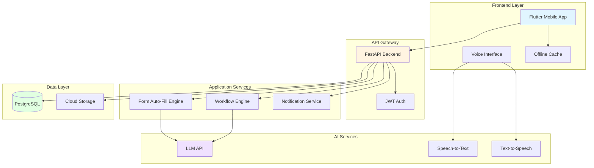

## Use Case Diagram

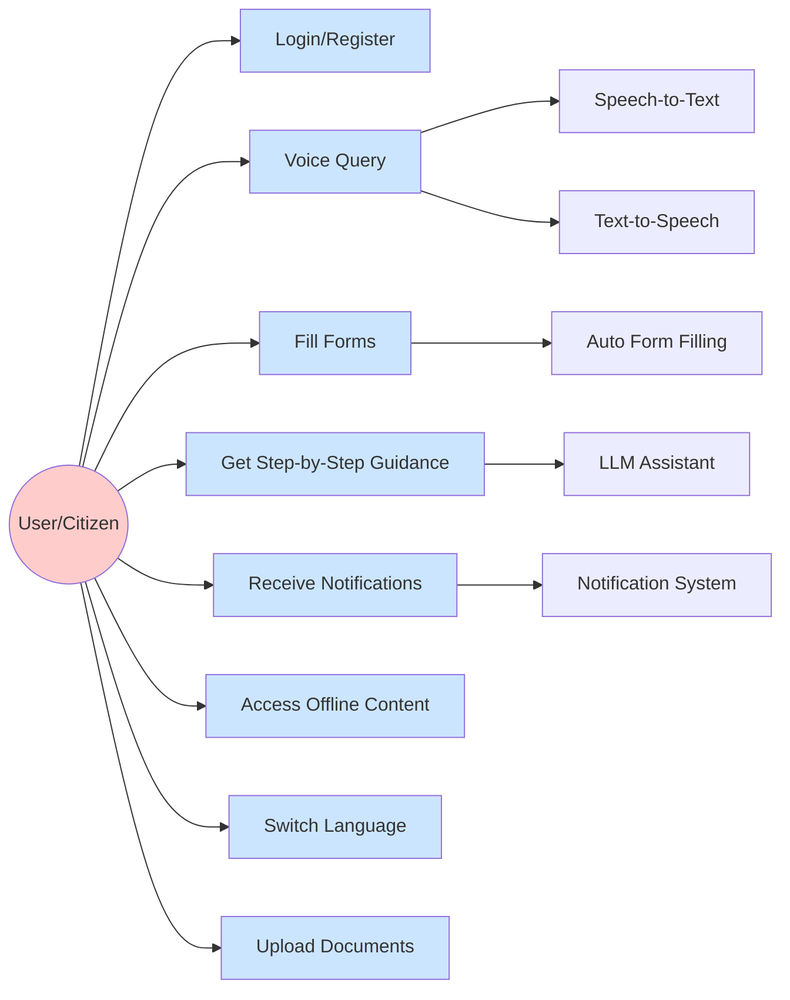

## Requirements

### Requirement 1: User Authentication and Authorization

**User Story:** As a citizen, I want to securely register and login to the system, so that I can access personalized civic services and maintain my information securely.

#### Acceptance Criteria

1. WHEN a new user provides valid registration information, THE Auth_Service SHALL create a new user account with encrypted credentials
2. WHEN a user provides valid login credentials, THE Auth_Service SHALL issue a JWT token with appropriate expiration time
3. WHEN a user's JWT token expires, THE Auth_Service SHALL require re-authentication before allowing access to protected resources
4. WHEN a user attempts to access protected resources without valid authentication, THE Civic_Assistant SHALL deny access and return an authentication error
5. THE Auth_Service SHALL enforce HTTPS for all authentication-related communications

### Requirement 2: Multilingual and Local Language Support

**User Story:** As a citizen who speaks a local language, I want to interact with the system in my preferred language, so that I can understand and access civic information without language barriers.

#### Acceptance Criteria

1. WHEN a user selects a preferred language, THE Civic_Assistant SHALL display all interface elements in that language
2. WHEN a user switches language during a session, THE Civic_Assistant SHALL update all content to the newly selected language without losing session state
3. THE Voice_Interface SHALL support speech recognition for all configured local languages
4. THE Voice_Interface SHALL support speech synthesis for all configured local languages
5. WHEN processing user queries, THE LLM_Service SHALL generate responses in the user's selected language

### Requirement 3: Voice-First Interface

**User Story:** As a citizen with limited literacy or visual impairment, I want to interact with the system using voice commands, so that I can access civic services without requiring text input.

#### Acceptance Criteria

1. WHEN a user speaks a query, THE Voice_Interface SHALL convert speech to text with accuracy sufficient for civic information queries
2. WHEN the system generates a response, THE Voice_Interface SHALL convert text to speech with natural-sounding pronunciation
3. WHEN voice input is unclear or ambiguous, THE Civic_Assistant SHALL request clarification through voice prompts
4. THE Voice_Interface SHALL support continuous conversation mode without requiring repeated activation
5. WHEN network connectivity is limited, THE Voice_Interface SHALL provide feedback about reduced functionality

### Requirement 4: Automated Form Filling

**User Story:** As a citizen filling out civic forms, I want the system to automatically populate form fields with my information, so that I can complete forms quickly and accurately.

#### Acceptance Criteria

1. WHEN a user initiates form filling, THE Form_Engine SHALL retrieve the user's stored profile information
2. WHEN the Form_Engine encounters a form field matching stored user data, THE Form_Engine SHALL automatically populate that field with the correct value
3. WHEN the Form_Engine populates a field, THE Civic_Assistant SHALL highlight the auto-filled fields for user review
4. WHEN a user modifies an auto-filled field, THE Civic_Assistant SHALL save the updated value for future use
5. WHEN required information is missing, THE Form_Engine SHALL prompt the user to provide the missing data through voice or text input
6. THE Form_Engine SHALL validate all populated fields against form requirements before submission

### Requirement 5: Step-by-Step Civic Process Guidance

**User Story:** As a citizen navigating complex civic processes, I want step-by-step guidance through each stage, so that I can complete processes correctly without confusion.

#### Acceptance Criteria

1. WHEN a user requests guidance for a civic process, THE Workflow_Engine SHALL provide a structured sequence of steps
2. WHEN a user completes a step, THE Workflow_Engine SHALL mark that step as complete and present the next step
3. WHEN a user requests clarification on a step, THE LLM_Service SHALL provide detailed explanation in the user's language
4. THE Workflow_Engine SHALL track user progress through multi-step processes across sessions
5. WHEN a user returns to an incomplete process, THE Civic_Assistant SHALL resume from the last completed step
6. THE Workflow_Engine SHALL provide visual and voice indicators of progress through the process

### Requirement 6: Message Notifications

**User Story:** As a citizen waiting for civic process updates, I want to receive timely notifications about status changes, so that I can take action when needed.

#### Acceptance Criteria

1. WHEN a civic process status changes, THE Notification_Service SHALL send a notification to the affected user
2. WHEN a deadline approaches for user action, THE Notification_Service SHALL send reminder notifications
3. THE Notification_Service SHALL support multiple notification channels including in-app, push notifications, and SMS
4. WHEN a user receives a notification, THE Civic_Assistant SHALL provide a direct link to the relevant process or information
5. WHEN a user is offline, THE Notification_Service SHALL queue notifications for delivery when connectivity is restored

### Requirement 7: Offline-First Functionality

**User Story:** As a citizen in an area with unreliable internet connectivity, I want to access previously viewed information and continue basic tasks offline, so that I can use the system despite connectivity issues.

#### Acceptance Criteria

1. WHEN a user views civic information while online, THE Cache_Manager SHALL store that information locally
2. WHEN a user accesses previously viewed content offline, THE Civic_Assistant SHALL retrieve and display the cached content
3. WHEN a user performs actions offline, THE Cache_Manager SHALL queue those actions for synchronization when connectivity is restored
4. WHEN connectivity is restored, THE Cache_Manager SHALL automatically synchronize queued actions with the backend
5. THE Civic_Assistant SHALL clearly indicate to users which features are available offline and which require connectivity
6. THE Cache_Manager SHALL manage storage efficiently by prioritizing frequently accessed and recent content

### Requirement 8: Document and Form Storage

**User Story:** As a citizen managing civic documents, I want to securely upload and store my documents in the system, so that I can access them when needed for various civic processes.

#### Acceptance Criteria

1. WHEN a user uploads a document, THE Storage_Service SHALL encrypt and store the document securely in cloud storage
2. WHEN a user requests a stored document, THE Storage_Service SHALL retrieve and decrypt the document for authorized access only
3. THE Storage_Service SHALL support common document formats including PDF, images, and scanned documents
4. WHEN storage quota is exceeded, THE Civic_Assistant SHALL notify the user and provide options to manage storage
5. THE Storage_Service SHALL maintain document metadata including upload date, document type, and associated civic processes
6. WHEN a user deletes a document, THE Storage_Service SHALL permanently remove the document and all associated metadata

### Requirement 9: Intelligent Query Processing

**User Story:** As a citizen with questions about civic services, I want to ask questions in natural language and receive accurate, helpful responses, so that I can get the information I need without navigating complex systems.

#### Acceptance Criteria

1. WHEN a user submits a query, THE LLM_Service SHALL process the query and generate a relevant response
2. WHEN a query is ambiguous, THE LLM_Service SHALL ask clarifying questions before providing a response
3. THE LLM_Service SHALL provide responses that include relevant civic process steps, requirements, and deadlines
4. WHEN a query requires current information not in the system, THE Civic_Assistant SHALL indicate the limitation and suggest alternative information sources
5. THE LLM_Service SHALL maintain conversation context across multiple exchanges within a session
6. WHEN a query involves form filling or document submission, THE LLM_Service SHALL guide the user to the appropriate workflow

### Requirement 10: Accessibility and Inclusion

**User Story:** As a citizen with disabilities or special needs, I want the system to be accessible through multiple interaction modes, so that I can access civic services regardless of my abilities.

#### Acceptance Criteria

1. THE Civic_Assistant SHALL support screen reader compatibility for all interface elements
2. THE Civic_Assistant SHALL provide high-contrast visual themes for users with visual impairments
3. THE Civic_Assistant SHALL support adjustable text sizes throughout the interface
4. THE Voice_Interface SHALL provide an alternative to all text-based interactions
5. THE Civic_Assistant SHALL support keyboard navigation for all functionality
6. WHEN displaying time-sensitive information, THE Civic_Assistant SHALL provide sufficient time for users to read and respond

### Requirement 11: Data Security and Privacy

**User Story:** As a citizen sharing personal information with the system, I want my data to be protected and used only for intended purposes, so that my privacy is maintained.

#### Acceptance Criteria

1. THE Civic_Assistant SHALL encrypt all personal data at rest using industry-standard encryption
2. THE Civic_Assistant SHALL encrypt all data in transit using HTTPS/TLS
3. WHEN a user requests data deletion, THE Civic_Assistant SHALL permanently remove all user data within a specified timeframe
4. THE Civic_Assistant SHALL not share user data with third parties without explicit user consent
5. THE Auth_Service SHALL implement rate limiting to prevent brute force attacks
6. THE Civic_Assistant SHALL log all access to sensitive user data for audit purposes

### Requirement 12: System Performance and Reliability

**User Story:** As a citizen relying on the system for time-sensitive civic processes, I want the system to be fast and reliable, so that I can complete tasks without delays or failures.

#### Acceptance Criteria

1. WHEN a user submits a query, THE Civic_Assistant SHALL respond within 3 seconds under normal network conditions
2. WHEN the LLM_Service is unavailable, THE Civic_Assistant SHALL provide cached responses or graceful degradation
3. THE Civic_Assistant SHALL maintain 99.5% uptime during business hours
4. WHEN system load is high, THE Civic_Assistant SHALL maintain response times through appropriate scaling
5. THE Civic_Assistant SHALL handle at least 1000 concurrent users without performance degradation


## Process Flow Diagrams

### User Registration and Authentication Flow

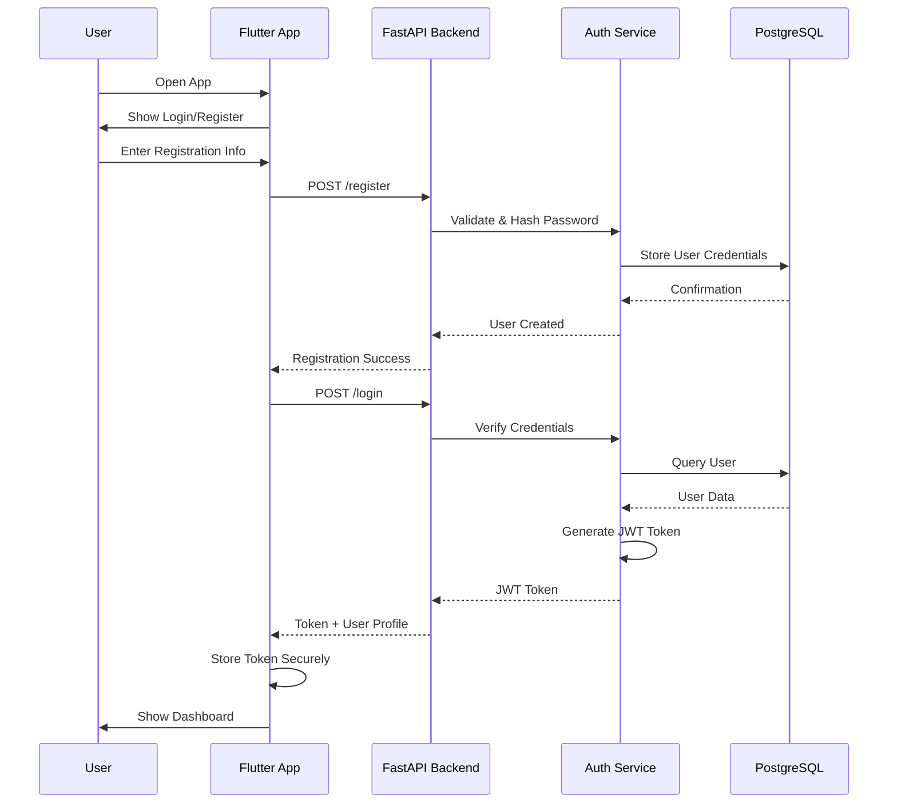

### Voice Query Processing Flow

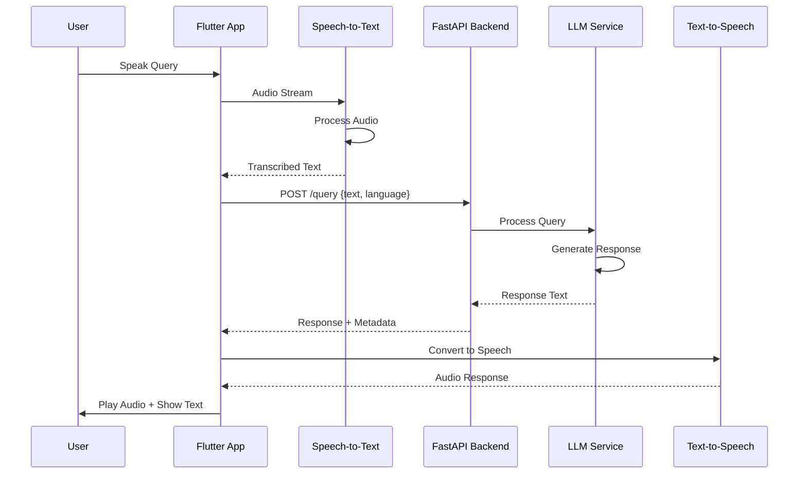

### Form Auto-Fill Process Flow

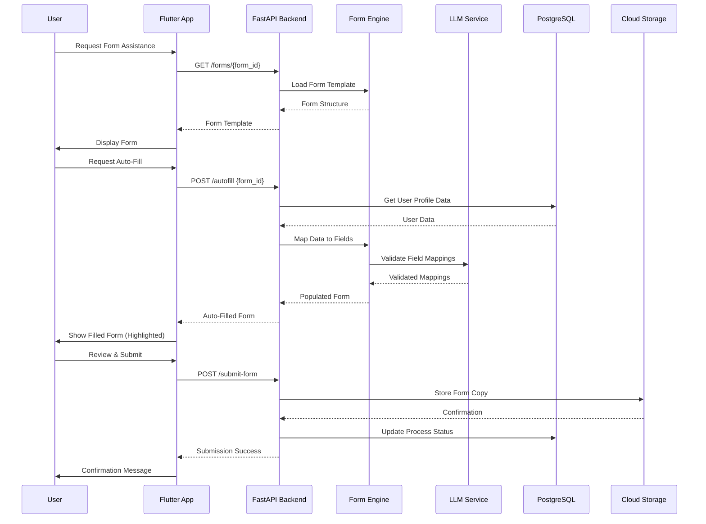

### Step-by-Step Guidance Flow

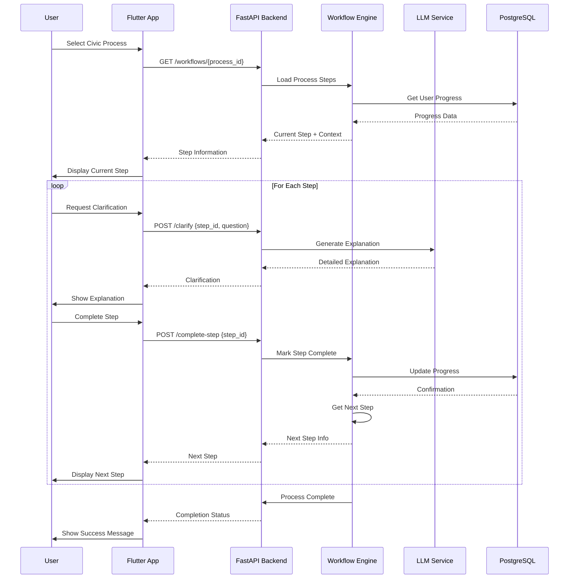

### Offline Synchronization Flow

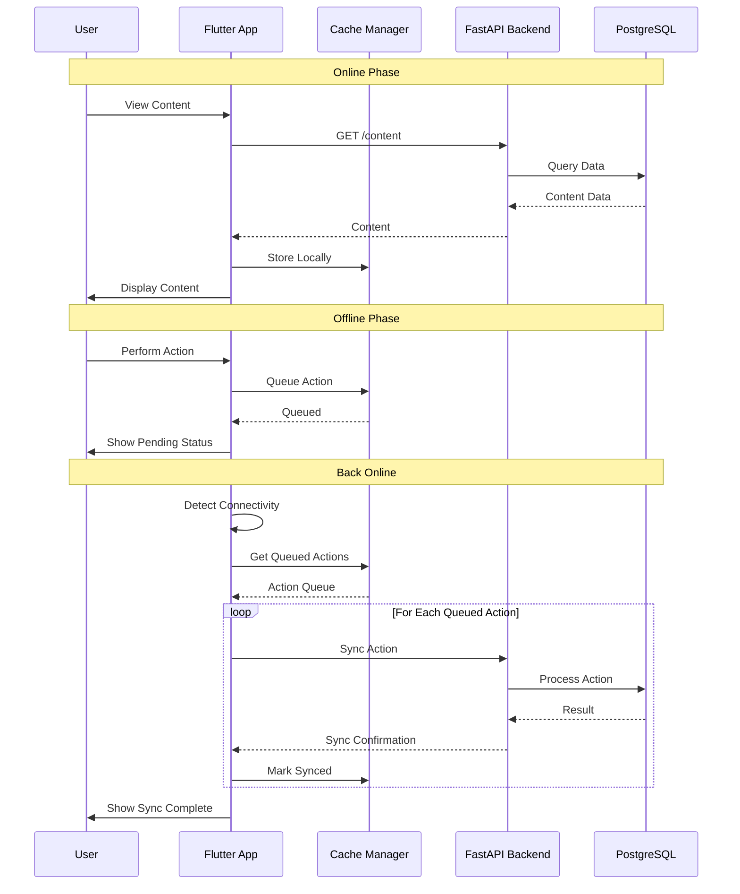

### Notification Delivery Flow

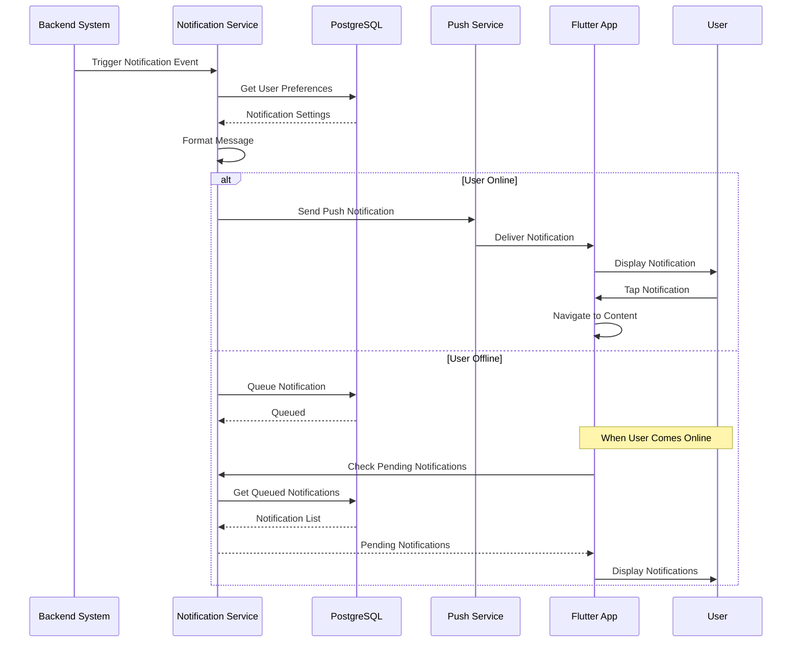

## Mock UI Diagrams

### Main Dashboard Screen

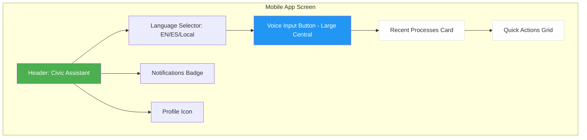

### Form Filling Screen

```mermaid
graph TD
    subgraph "Form Screen"
        A[Back Button | Form Title]
        B[Progress Bar: 60% Complete]
        C[Auto-Fill Button]
        D[Form Field 1 - Auto-filled - Highlighted]
        E[Form Field 2 - Auto-filled - Highlighted]
        F[Form Field 3 - Empty]
        G[Voice Input Helper]
        H[Document Upload Section]
        I[Save Draft Button]
        J[Submit Button]
        
        A --> B
        B --> C
        C --> D
        D --> E
        E --> F
        F --> G
        G --> H
        H --> I
        I --> J
    end
    
    style A fill:#4CAF50,color:#fff
    style C fill:#FF9800,color:#fff
    style D fill:#FFEB3B
    style E fill:#FFEB3B
    style J fill:#4CAF50,color:#fff
```

### Step-by-Step Guidance Screen

```mermaid
graph TD
    subgraph "Guidance Screen"
        A[Process Name Header]
        B[Overall Progress: Step 3 of 7]
        C[Step 3: Current Step Title]
        D[Step Description Text]
        E[Voice Explanation Button]
        F[Clarification Chat Box]
        G[Required Documents List]
        H[Mark Complete Button]
        I[Previous Step | Next Step]
        
        A --> B
        B --> C
        C --> D
        D --> E
        E --> F
        F --> G
        G --> H
        H --> I
    end
    
    style A fill:#4CAF50,color:#fff
    style C fill:#2196F3,color:#fff
    style E fill:#FF9800,color:#fff
    style H fill:#4CAF50,color:#fff
```

## Technical Architecture Diagram

```mermaid
graph TB
    subgraph "Client Layer"
        A[Flutter Mobile App]
        A1[UI Components]
        A2[State Management]
        A3[Local Storage/Cache]
        A4[Voice Interface]
        
        A --> A1
        A --> A2
        A --> A3
        A --> A4
    end
    
    subgraph "API Gateway Layer"
        B[FastAPI Application]
        B1[JWT Middleware]
        B2[Rate Limiting]
        B3[Request Validation]
        B4[HTTPS/TLS]
        
        B --> B1
        B --> B2
        B --> B3
        B --> B4
    end
    
    subgraph "Service Layer"
        C[Authentication Service]
        D[Form Engine Service]
        E[Workflow Service]
        F[Notification Service]
        G[Document Service]
    end
    
    subgraph "AI/ML Layer"
        H[LLM API Integration]
        I[Speech-to-Text Service]
        J[Text-to-Speech Service]
        K[Prompt Engineering Module]
    end
    
    subgraph "Data Layer"
        L[(PostgreSQL Database)]
        L1[User Data]
        L2[Form Templates]
        L3[Workflow Definitions]
        L4[Audit Logs]
        
        L --> L1
        L --> L2
        L --> L3
        L --> L4
    end
    
    subgraph "Storage Layer"
        M[AWS S3/Cloud Storage]
        M1[User Documents]
        M2[Form Submissions]
        M3[Cached Content]
        
        M --> M1
        M --> M2
        M --> M3
    end
    
    subgraph "Infrastructure"
        N[Docker Containers]
        O[AWS Cloud Services]
        P[Load Balancer]
        Q[Monitoring & Logging]
    end
    
    A --> B
    A4 --> I
    A4 --> J
    B --> C
    B --> D
    B --> E
    B --> F
    B --> G
    D --> H
    E --> H
    K --> H
    C --> L
    D --> L
    E --> L
    F --> L
    G --> M
    B --> N
    N --> O
    O --> P
    O --> Q
    
    style A fill:#e1f5ff
    style B fill:#fff4e1
    style H fill:#f0e1ff
    style L fill:#e1ffe1
    style M fill:#ffe1e1
```

## Data Flow Diagram

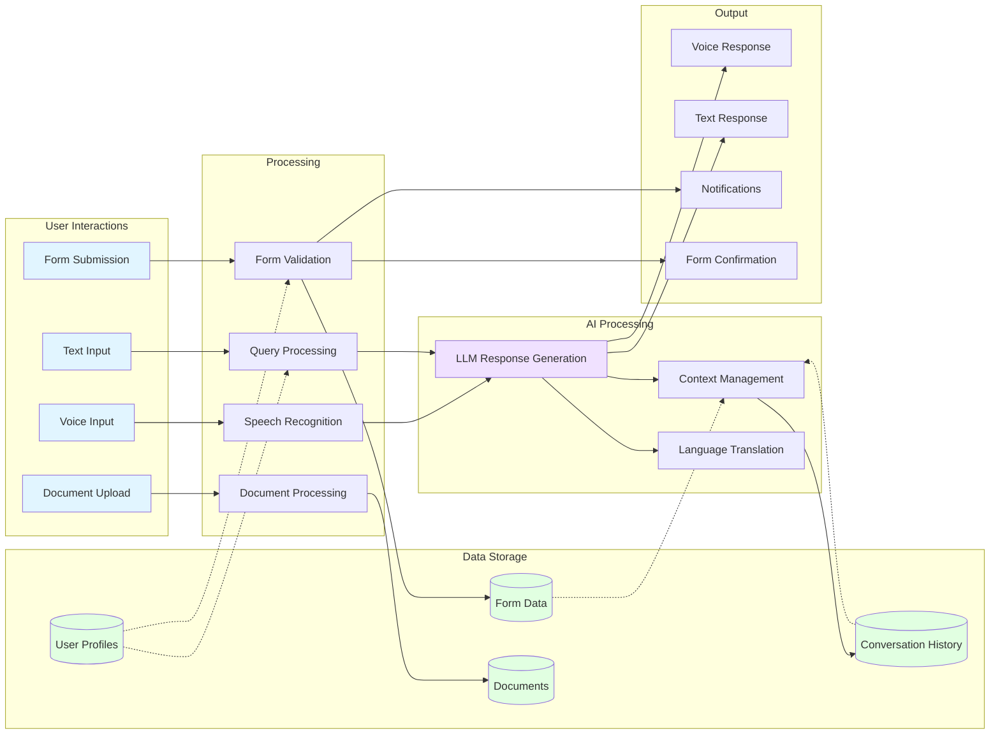

## Security Architecture

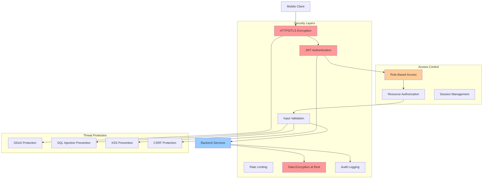

## Summary

This requirements document defines a comprehensive civic information assistant system that prioritizes accessibility, inclusion, and real-world community impact. The system combines modern AI capabilities with voice-first interactions, multilingual support, and offline-first architecture to serve diverse communities with varying levels of connectivity and digital literacy.

The requirements emphasize:
- Secure authentication and data protection
- Voice-first interactions for accessibility
- Automated form filling to reduce complexity
- Step-by-step guidance through civic processes
- Offline functionality for low-connectivity areas
- Multilingual support for diverse communities
- Intelligent AI-powered assistance

All requirements follow EARS patterns and INCOSE quality standards to ensure clarity, testability, and completeness.
